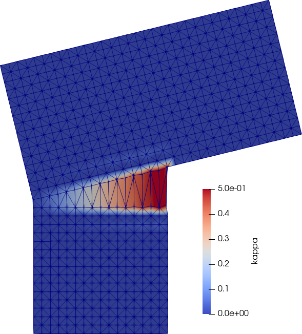
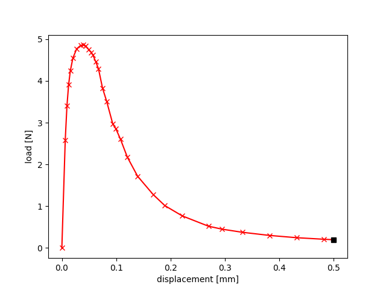
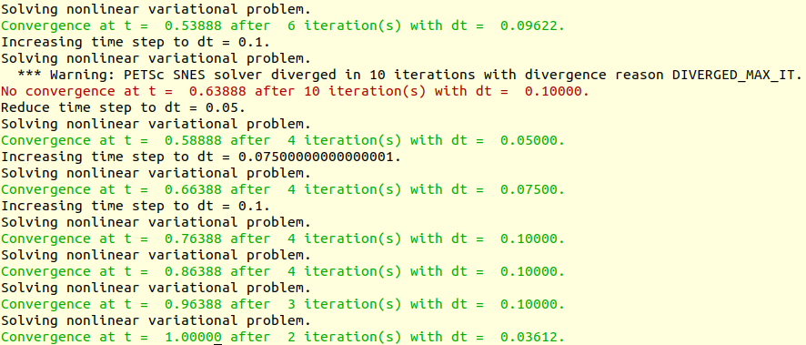

# fenics_helpers

Little Helper classes that come up repeatedly when writing solvers in FEniCS

# Installation

- via pip/pip3 
~~~
> pip3 install --user git+https://github.com/nutofem/fenics_helpers.git
~~~
- via including it into `setup.py` of another project
~~~py
# within setup.py 
setuptools.setup(
    name="your project",
    ...
    install_requires=["some", "packages",
    "fenics_helpers @ https://github.com/nutofem/fenics_helpers/tarball/use_find_packages"],
    "more", "packages"],
    ...
)
~~~

# Example: Local damage model

The [local damage](examples/local_damage.py) example illustrates the use of `.boundary` to conveniently select the boundaries like

~~~py
bot = fh.boundary.plane_at(-10, "y") 
right = fh.boundary.plane_at(10, "x") 
~~~

and the adaptive `.timestepping` module.

Example `stdout`:

